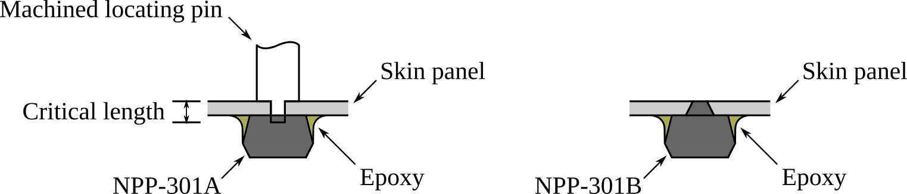

# Use of Amphenol NPP-301 Series Pressure Transducers for Testing in Wind Tunnels

## 1. Overview
The NPP-301 series of pressure sensors manufactured by Amphenol Advanced Sensors have demonstrated to be a low cost means of collecting discrete pressure measurements in space constrained locations on wind tunnel models. The transducer is offered in three pressure ranges, 0 – 100 kPa, 0 - 200 kPa, and 0 – 700 kPa.

## 2. Electrical Characteristics

Figure 1 presents the electrical schematic of the NPP-301 as supplied by Amphenol. The large variation in transducer input and output impedance (20% [1]) results in a large amount of transducer-to-transducer variation. Additionally, because the operating pressure can be an order of magnitude lower than the rated pressure, the transducer is having to operate at the extremity of its operating range. The split negative input pins (Pins 4 & 5) allow for the bridge to be compensated through the use of an additional resistor. This compensation allows for the bridge to be balanced at a desired pressure. This has two effects. First, the balanced bridge means that the bridge output voltage is minimised, allowing for greater amplifier dynamic range. Secondly, the bridge compensation process reduces the large variation in transducer output performance between sensors, allowing for simpler amplifiers to be used.

## 3. Frequency Response

Frequency response has not been characterised, but is estimated to be on the order of several kilohertz.

## 4. Bridge Compensation

Bridge compensation is performed using a vacuum cell with a 5 wire feed-through, a mounting PCB or carrier board for connecting to the sensor and a digital multimeter. Details of calibration carrier boards are provided in appendix A.

Bridge compensation is performed as follows:
* If not mounted to a PCB, transducer body is marked for identification. If mounted to a PCB, PCB is typically marked. Transducer is then placed in the integrated circuit socket.
* Mounting PCB or test socket is interconnected through the vacuum cell feed-through, with 5 flying-lead wires available externally for measurement connections.
* Vacuum cell is evacuated to the desired compensation pressure. This is typically $\<$ 100 Pa for wind tunnel testing with evacuated test sectionbs. Ambient temperature during the calibration should also be recorded.
* The following resistances are then measured between pin pairs on the transducer body, using externally available wires. Pin 8 & 2, Pin 8 & 6, Pin 2 & 4, and Pin 6 & 5. Resistance values will typically be in the 4500 - 4900 Ω range and should be recorded to the nearest ohm.

This procedure is repeated for each transducer with the results being populated in a text file called 'resistor_data.txt'. File should be TAB delimited. The resistor_data text file takes the following format:
'''
PIN 8/2  PIN 8/6	PIN 2/4	PIN 6/5
'''

Again, resistance of each measurement element should be recorded in ohms to the nearest ohm. An example have been provided in 'resistor_data.txt'. Once complete, the compensation values for each individual transducer can be determined. To do this, the MATLAB script 'npp_comp.m' is used. Note: 'npp_comp.m' requires 'resval.mat' in order to run successfully. 'resval.mat' is also provided as a comma-separated values file. The script, when run, will evaluate all resistance values present in the 'resistor_data.txt' data file. For each transducer, a suggested compensation resistor value will be provided based on commercially available resistance values (contained in 'resval.mat'), and the branch of the wheatstone bridge this resistance should be provided. The script will also provide a bridge output voltage (Vb) for a given bridge input voltage at the compensated pressure. It is advised that the reported resistance is then recorded in a transducer calibration register (see 'npp_calibration_register_blank.ods') as this will be cleared from the screen when the script is run again. The following provides an example of the script output for a transducer with the values PIN 8/2 = 4726, PIN 8/6 = 4752 PIN 2/4 = 4769 PIN 6/5 = 4742.

```
------
OUTPUT
------
Input Voltage: 5V
Suggested Compensation Resistance: 51 Ohms
Compensation on Leg: 865
Vb: 0.58314 mV
```
Figure 3 presents a revised schematic that includes the compensation resistor and its position within the circuit. It can be seen that the compensation resistor is connected between pins 4 & 5, with the IN- connection point becoming pin 4. Depending on the mounting configuration, the means in which this resistor can be included into the pressure transducer can vary. Two methods are presented here, PCB mounting (subsection 5.1) and ’deadbug’ mounting (subsection 5.2).


## 5. Packaging and Mounting

The NPP-301 is available in a small-outline 8 (SO8) surface mount package with either a barbless (NPP-301A) or barbed (NPP-301B) pressure port [1]. Dimensions of the barbed and barbless packaging are
available in appendix A. Two mounting options have been explored thus far. Printed circuit board (PCB) mounting and ‘deadbug’ mounting.

### 5.1 PCB Mounting

PCB mounting allows for a transducer to be rigidly mounted to a structure with fasteners. Multiple transducers can also be mounted to a single PCB to simplify interconnectivity and maximise measurement density. The SO8 package size and placement of the barb limits the pitch of an array of transducers to 8 mm. A pitch of 10 mm was achieved for the HyMAX oscillating shock impingement study. An example of a transducer mounted to a single PCB is provided in Fig. 4. This arrangement where the transducer body is offset from the horizontal centreline of the PCB is done so to place the barb in the horizontal and vertical centre of the board. Four mounting holes suitable for M1.6 fasteners are used in each corner. On the reverse side of the PCB; pads for soldered wire connections are provided, along with pads for surface mount 0402 size compensation resistors. To ensure a adequate pressure connection between the pressure port of the sensor and the pressure tap on the surface of the model, a BS003 o-ring is used to provide a seal. Geometry for the o-ring groove is provided in appendix B. Typical dimensions of a single transducer mounting PCB is also provided in appendix B.


### 5.2 Deadbug Mounting

Deadbug mounting, named due to the appearance of an integrated circuit package body upside down, is the other proposed method for interconnecting and mounting the transducer. This mounting type is the most volumetrically efficient, but is more time consuming the manufacture and mounting into a model is permanent. Instructions to assembly a transducer body with wire is provided in appendix C. Transducer bodies are typically bonded into cavities or against panels using epoxy (or other suitable) adhesive. This is depicted in Fig. 5. When using the barbless ‘A’ package, ensuring concentricity between the pressure tap in the panel and port in the transducer can be achieved by using a machined locating pin to locate the transducer during assembly. When using the barbed ‘B’ package, a countersink in the surface is required to accommodate the barb. This countersink ensures port concentricity during mating.



## References

[1] Amphenol Advanced Sensors. NPP-301 Series Surface Mount Pressure Sensor, 3 2019. web: https://www.amphenol-sensors.com/hubfs/Documents/AAS-920-297B-NovaSensor-NPP-301-031414-web.pdf


